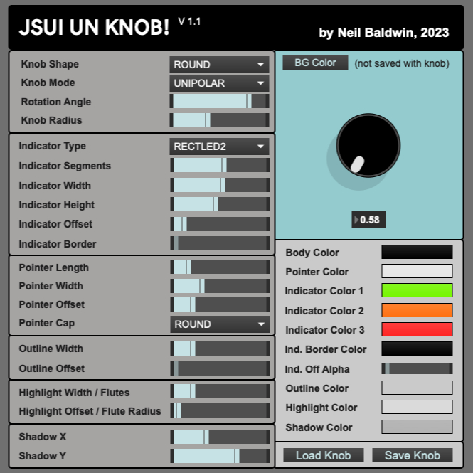
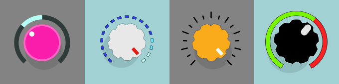

# JSUI UN KNOB! V1.1

## What is JSUI UN KNOB!?

JSUI_UN_KNOB is a Max 8 tool for designing and authoring JSUI knobs without having to do any coding! I know!

*Editor in Max*

 

*Some examples*

## Why is JSUI UN KNOB?!

Good question. It basically started out as a little learning project I made for myself whilst trying to learn JSUI in Max. Then it morphed into an arguably useful little tool.

Because of it's editor-based nature, the JSUI code for drawing the knobs isn't bleeding-edge efficient. The code is fairly readable though and structured fairly nicely so if you know your way around you could probably hack out the parts/options you don't need to make the payload smaller.

It's also obviously designed through my own lens of what I thought were handy/cool features. Again, if you've got some experience you should easily be able to take some of the code and change it for your own purposes or even extend/add to it.

Any questions on that front you can regularly find me on the Max Dicord server as 'neilbaldwin'

## Support My Work

If you like my work and use it or learn from it, please consider supporting me or just a donation to say thanks:

## Requirements

As it's a Max 8 patcher/Javascript tool you'll need Max 8.

## Installation

Unzip the contents into a foler. Put the folder in your Max File Preferences paths.

## Usage and Warranty

Use at your own risk. There isn't really any risk but of course you can never be 100% sure. If something goes wrong then I'm very sorry in advance. On the other hand, if JSUI_UN_KNOB positively changes your life in a meaningful way I will take credit for that.

## Version History

V1.1 release, September 2023.

## Contents

JSUI_UN_KNOB has multiple files:

* **JSUI_UN_KNOB_ED.maxpat** This is the Max patcher file that containts the editor. Here you can editor your knob designs and save them as a .JSON file.

* **JSUI_UN_KNOB_ED.js** This the the Javascript file loaded by the editor .maxpat

* **JSUI_UN_KNOB.js** This is the JSUI wrapper that you would include in your Max project once you have designed a knob with the editor. You can specify the knob JSON file in the *JavaScript File* parameter in the **jsui** section in the Max Inspector window/panel.

* **JSUI_UN_KNOB_CLASS.js** This is the "class" file that contains the code for drawing the knob.

* **JSUI_UN_KNOB_VALUE_SLIDER.maxpat** and **JSUI_UN_KNOB_COLOR_PICKER.maxpat** These are two helper bpatchers for value and color editing in the editor.

* **defaultKnob.json** This is the definition for the default knob and is loaded by the editor on opening.

* **JSUI_UN_KNOB_DOCS.md** This file.

## How To Use JSUI_UN_KNOB

* Load the JSUI_UN_KNOB_ED.maxpat into Max.

* Edit the knob design using the handy controls.

* Save your amazing design to a JSON file.

* Add a `JSUI` object to your Max project with the following parameters:

  `JSUI @filename JSUI_UN_KNOB.js @jsarguments yourKnob.json`

* Ponder at how much time I just saved you and send me beer/coffee/PayPal as a token of your grattitude.

## Editor Controls

*Knob Shape*

You can choose between round and *fluted*. In *fluted* mode "Highlight Width" and "Highlight Offset" control fluting parameters. See below.

*Knob Mode*

You can choose betwen *UNIPOLAR* and *BIPOLAR*. This affects both the style of the *Indicator* (see below) and also the output from the knob. In *UNIPOLAR* mode the output goes from 0.0 to 1.0 and in *BIPOLAR* mode the output goes from -1.0 to 1.0. 

*Rotation Angle*

This sets the total angle of the knob rotation. You can vary it between 90 and 340 degrees.

*Knob Radius*

This sets the radius size relative to the JSUI patcher rectangle size. You can scale the JSUI (JSUI_UN_KNOB.js) patcher as you'd expect. This control just sets the relative size of the knob to the patcher rectangle.

*Indicator Type*

**Indicator** refers to an added graphical feature that gives you an graphical indication of the knob's value. There are several types to choose from:

* NONE - you know....none.
* LINE1 - displays static radial lines around the knob circumference
* LINE2 - same as LINE1 but every other line is half the height
* ARC - displays a dynamic colored arc around the knob
* RNDLED1 - displays an arc of round "LED"s around the knob
* RNDLED2 - similar to RNDLED1 but the "off" LEDs can be transparent
* RECTLED1 - same as RNDLED1 but the "LED"s are rectangular
* RECTLED2 - same as RNDLED2 but the "LED"s are rectangular

NONE, LINE1 and LINE2 are *static* as in they are not animated.

ARC, RNDLED1, RNDLED2, RECTLED1, RECTLED2 are animated.

*Indicator Segments*

For RNDLEDx and RECTLEDx this defines how many *LEDs* make up the indicator.

*Indicator Width*

For RND/RECTLED this is the width of the individual segments. For indicator type "ARC" this defines the thickness of the arc.

*Indicator Height*

This only affects RECTLED1/RECTLED2 and defines the height of the rectangular segments.

*Indicator Offset*

This defines the space between the knob and the indicators.

*Indicator Border*
For RND/RECTLED indicators, this is the stroke width on the segments. For indicator "ARC" this is the the stroke width on the arc.

*Pointer Length*

This determines the overall length of the knob pointer. You can vary this between 0 (off) and 2.0 which spans the entire knob (the value is a ratio of the overall knob diameter).

*Pointer Width*

This determines the width of the pointer.

*Pointer Offset*

This defines the position of the pointer from the circumference of the knob.

*Outline* is a graphical element defined outwards from the circumference of the knob. *Highlight* is a graphical element defined *inwards* from the circumference of the knob.

*Outline Width*

Outline is a stroke added to the outer edge of the circumference of the knob. This defines the width of the stroke.

*Outline Offset*

This defines the position offset of the highlight from the outer edge of the knob. Positive values move the outline away from the edge of the knob.

*Highlight Width/Flutes*

* In *Knob Shape*: ROUND, this defines the width of the stroke of an ellipse drawn from the inside of the knob circumference.

* In *Knob Shape*: FLUTED this determines the number of *flutes* or *ridges* in the knob's circumference.

*Highlight Offset/Flute Radius*

* In *Knob Shape*: ROUND this defines the position of the Highlight ellipse from the inside edge of the knob circumference. Poisitve values move the Highlight towards the knob center.

* In *Knob Shape*: FLUTED this defines the inner radius of the flutes.

*Shadow X / Shadow Y*

This defines the X/Y position of the shadow in relation to the knob. Offsets can be positive or negative.

### Color Parameters

Set colors by clicking on the color swatch. This will open up a system color picker.

*Body Color*
This is the main color of the knob.

*Pointer Color*
This sets the color of the knob pointer.

*Indicator Colors*

* In indictor modes *LINE1* and *LINE2*, *Indicator Color 1* sets the fill color of the lines.

* In *ARC + UNIPOLAR* mode, *Indicator Color 1* sets the "on" color and *Indicator Color 3* sets the "off" color. In *ARC + BIPOLAR* mode, *Indicator Color 3* sets the "off" color while Color 1 and 2 set the left and right arc colors respectively.

* In *RNDLED1* and *RECTLED1* indicator modes, *Indicator Color 1,2 and 3* set the "normal", "high" and "highest" mimicking a LED VU meter. Segments to the right of the pointer are displayed black.

* *RNDLED2* and *RECTLED2* indicator modes, *Indicator Color 1, 2 and 3* work the same as *RNDLED1* and *RECTLED1* but segments to the right of the pointer are transparent versions of Color 1, 2 and 3 (depending on the pointer position). You can set the transparency of the segments with *Indicator Off Alpha*.

*Indicator Border Color*

Sets the color of the border around each indicator segment.

*Indicator Off Alpha*

In Indicator Modes *RNDLED2* and *RECTLED2* this sets the transparency of the indicator segments to the right of the pointer.

*Outline Color*

Sets the color of the Outline.

*Highlight Color*

Sets the color of the Highlight.

*Shadow Color*

And this sets the color of the shadow.

**BG Color**

You can use this to set the color behind the knob. This is only for the editor. The knob background is always transparent when you use them in your own application.

### Load and Save

You can click the *Load Knob* and *Save Knob* buttons to load and save knob presets to disk. The presets are saved as a JSON file.

On loading the editor the file "defaultKnob.json" is loaded.

### Compile JS

This button is included to enable you to manually recompile the editor Javascript file. The *autowatch* feature is enabled which means the script should recompile itself when required but sometimes it doesn't behave properly.

WARNING: clicking this will reset the editor to default so you will lose any edits you've made unless you've saved the knob file.

